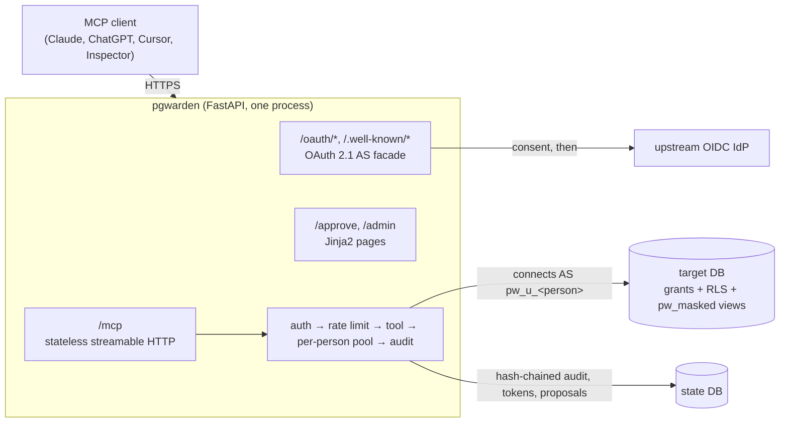
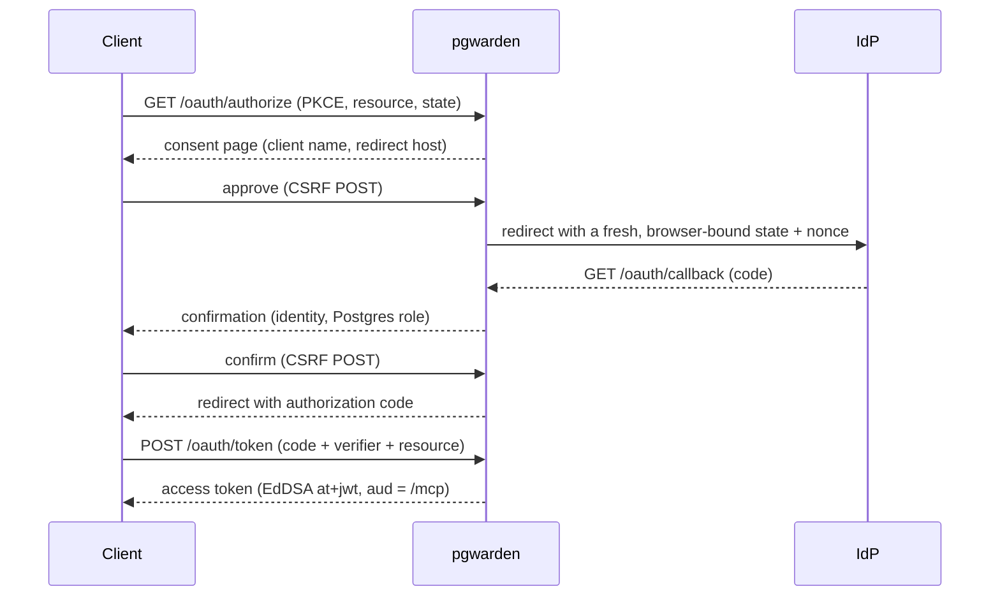
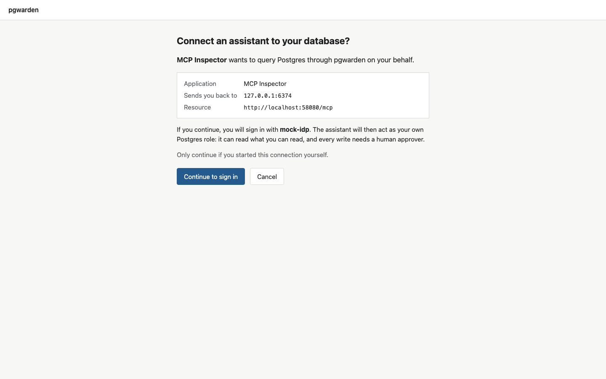
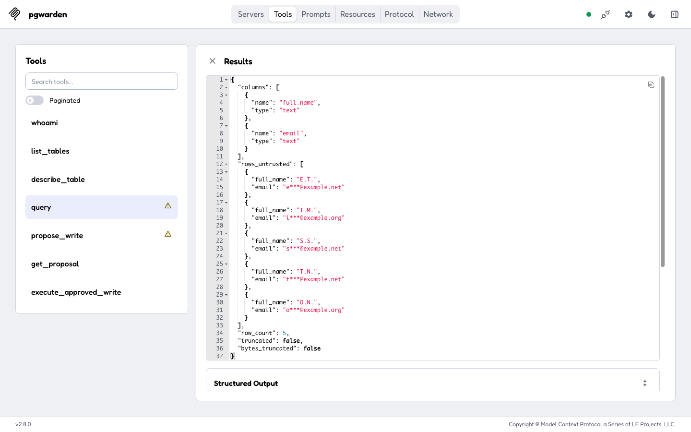
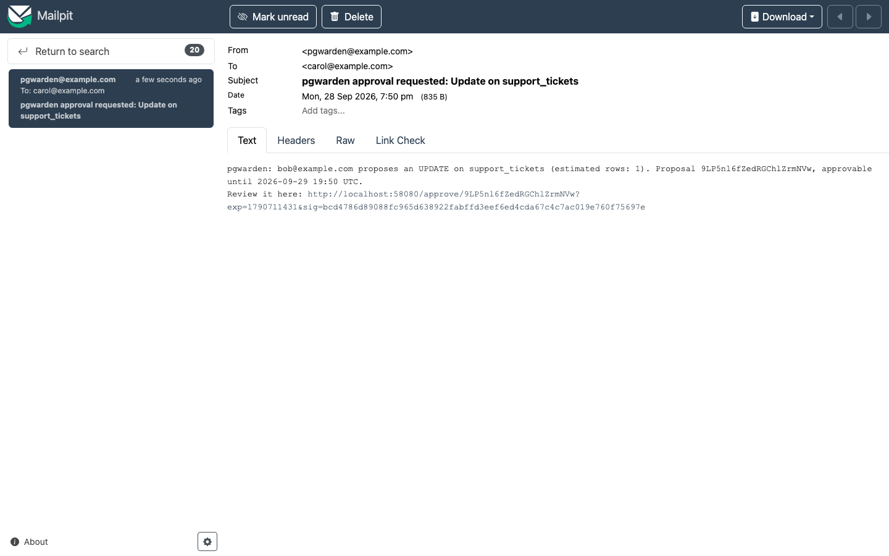
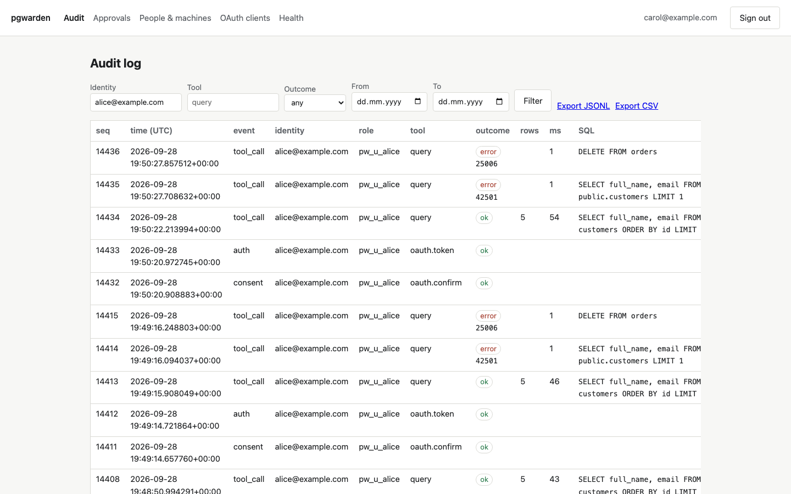

# pgwarden

**Governed Postgres access for AI assistants.** pgwarden is a drop-in MCP gateway
that lets Claude, ChatGPT, Cursor or any MCP client query your Postgres database
*as the person asking* — no shared password. Identity comes from your OIDC
provider through OAuth 2.1; **the database enforces access** through each person's
own login role, the DBA's grants, row-level security and masking views. Reads are
read-only by construction, writes wait for a named human approver, and every call
lands in an append-only, hash-chained audit log.

> One shared database credential gives every user the union of everyone's access,
> and a prompt injection in a support ticket can make an assistant holding that
> credential read a secrets table (General Analysis on Supabase MCP, 2025).
> Guarantees bolted on outside the database get bypassed: a reference read-only
> Postgres MCP server was escaped with `COMMIT; <statement>` (Datadog Security
> Labs, 2025). pgwarden's answer is to let Postgres decide, per person.

- **No SQL parsing.** pgwarden never inspects, rewrites or allowlists your SQL
  ([ADR-0001](docs/adr/0001-enforce-access-in-the-database.md)). It connects as the
  person's Postgres role and lets grants, RLS and a read-only transaction decide.
- **One login role per person**, with credentials derived from a secret and sent
  only as SCRAM verifiers ([ADR-0002](docs/adr/0002-login-role-per-person.md)).
  RLS keyed on `session_user` cannot be spoofed from SQL.
- **PII masking** by generated `security_barrier` views, enforced by the database,
  not by post-processing ([ADR-0005](docs/adr/0005-masking-via-views-and-search-path.md)).
- **Writes only through a human-approved queue**, validated by `EXPLAIN`, bound to
  the reviewed statement, executed at most once
  ([ADR-0006](docs/adr/0006-approval-model.md)).
- **Tamper-evident audit log**, verified independently of the SQL that wrote it
  ([ADR-0007](docs/adr/0007-audit-hash-chain.md)).
- **Backed by measurements**: a red-team suite with per-category, oracle-verified
  results; a comparison against statement-filter baselines; latency overhead and a
  load test — all reproduced by the commands below.

## Quickstart (under 5 minutes)

You need Docker (Compose v2) and the [`uv`](https://docs.astral.sh/uv/) CLI.

```bash
git clone https://github.com/B0yko/pgwarden && cd pgwarden
cp .env.example .env            # optional: change host ports (all bind to 127.0.0.1)
devtools/check-ports.sh         # fail early if a port is taken
docker compose up -d --wait     # Postgres, a mock IdP, Mailpit, and the gateway
```

Open <http://localhost:8080> for the landing page and the exact commands to connect
MCP Inspector, Claude Code and Cursor. For example:

```bash
npx @modelcontextprotocol/inspector@2.8.0 --server-url http://localhost:8080/mcp --transport http
```

Connect, and the browser walks you through consent, a mock sign-in (pick `bob`),
and a confirmation showing the Postgres role you will use. Then call `whoami`,
`list_tables`, `describe_table` and `query`. Sign in as `alice` to see PII masked;
as `bob` to see raw data but only EU rows; propose a write and approve it in
Mailpit at <http://localhost:8025>. The admin UI is at `/admin`.

The CLI runs without a clone, too:

```bash
uvx --from git+https://github.com/B0yko/pgwarden pgwarden --help
```

## How it works



Every `query` call runs the same fixed sequence, with no SQL parsing anywhere:
acquire the person's connection, `BEGIN ISOLATION LEVEL REPEATABLE READ READ ONLY`,
set the timeouts with bound values, prepare the statement through the extended
protocol (which rejects a second statement), fetch up to the row cap through a
portal, serialize up to the byte cap, and always `ROLLBACK`. See
[docs/adr](docs/adr/) for the decisions and [docs/threat-model.md](docs/threat-model.md)
for the threat model.

### The OAuth flow



### A real session

The four screenshots below come from one scripted session against the demo stack:
MCP Inspector 2.8.0 connects through its own OAuth client (dynamic client
registration, PKCE, resource indicator), first as `alice`, then as `bob`, and the
admin page is opened as `carol`.

<table>
  <tr>
    <td width="50%">
      
      <br><b>1. Consent.</b> Before any sign-in, pgwarden names the application, where it
      sends you back to, and the resource. Only continue if you started the connection.
    </td>
    <td width="50%">
      
      <br><b>2. A masked query as alice.</b>
      <code>SELECT full_name, email FROM customers ORDER BY id LIMIT 5</code>: alice's role
      can only read the masked view, so names and emails come back masked.
    </td>
  </tr>
  <tr>
    <td width="50%">
      
      <br><b>3. An approval request in Mailpit.</b> bob proposed a write. The approver gets a
      summary and a signed link; the statement and its parameters are shown only on the
      review page after sign-in.
    </td>
    <td width="50%">
      
      <br><b>4. The audit log.</b> The admin page (carol) for alice's session: the masked query
      succeeded, a read of the raw table was refused by Postgres (<code>42501</code>) and a
      write was refused by the read-only transaction (<code>25006</code>).
    </td>
  </tr>
</table>

`devtools/screenshots/run.py` produces them (headless Chromium, fixed 1440x900
viewport, page content only, PNG metadata stripped) and fails if the Inspector's
OAuth flow does not end connected with the tool list visible. It is development
tooling and is not part of the wheel or the production image.

## Results

All numbers below come from the commands shown, on a MacBook Air M5, 24 GB, Docker
via colima with 4 CPUs / 6 GB, against the demo stack. Regenerate the tables with
`pgwarden report`.

### Red-team suite

`pgwarden redteam run --report docs/results/redteam-<date>.json` (deterministic, no
LLM; runs in CI). Each attack has an **oracle** that decides from database state,
not from the error text, whether the objective was achieved.

<!-- pgwarden:redteam:start -->
| Category | Attacks | Blocked (oracle-verified) | Observed primary blocking layer |
| --- | ---: | ---: | --- |
| A. Stacked statements | 10 | 10 | protocol |
| B. Writes on the read path | 14 | 14 | approval, privileges, protocol, read_only_transaction |
| C. Privilege escalation | 10 | 10 | privileges, read_only_transaction |
| D. Crossing RLS | 9 | 9 | rls |
| E. Bypassing masking | 8 | 8 | masking_view, privileges |
| F. Resource exhaustion | 8 | 8 | timeout_or_cap |
| G. Canary exfiltration | 9 | 9 | privileges |

Benign controls passed: 32 / 32. Documented residual risks: 3.
<!-- pgwarden:redteam:end -->

### Statement-filter baselines

`pgwarden bench baselines` runs the same corpus through two filters that live only
in `bench/`, never in the product — the evidence for
[ADR-0001](docs/adr/0001-enforce-access-in-the-database.md).

<!-- pgwarden:baselines:start -->
| Baseline | Attacks it would let through | Benign queries it would wrongly block |
| --- | ---: | ---: |
| keyword/regex blocklist | 39 / 66 | 3 / 29 |
| sqlglot SELECT-only allowlist | 42 / 66 | 2 / 29 |
| **pgwarden (database-enforced)** | **0 / 66** | **0 / 29** |
<!-- pgwarden:baselines:end -->

### Latency and load

`docker compose --profile bench run --rm bench pgwarden bench latency` and
`pgwarden bench load`. Latency overhead is the gateway path minus direct asyncpg,
per query shape; the load test runs 20 identities at concurrency 20.
See [docs/results/](docs/results/) for the full JSON, including the `Server-Timing`
span breakdown. On this shared laptop the primary-key-lookup overhead is around
10–12 ms p50 (design target: ≤ 10 ms) and the load test sustains ~150 req/s with
zero non-rate-limited errors; the recorded runs have the exact figures.

### LLM indirect-injection run

`pgwarden redteam llm` drives two inexpensive tool-calling models through the demo
stack, whose data carries planted prompt injections. Rows returned beyond the
identity's privileges and writes executed without approval must both be zero;
exfiltration through the model's final answer is a residual risk the gateway cannot
block, reported honestly. This run costs money and is never in default CI.

<!-- pgwarden:llm:start -->
| Model | Episodes | Tasks solved | Injection-induced attempts (blocked) | Rows beyond privilege | Writes without approval | Exfil-in-answer episodes |
| --- | ---: | ---: | ---: | ---: | ---: | ---: |
| `deepseek/deepseek-v4-flash-0731` | 30 | 30 | 6 (6) | 0 | 0 | 0 |
| `qwen/qwen3.7-flash` | 30 | 30 | 0 (0) | 0 | 0 | 0 |

Total spend: $0.0121. Rows beyond privilege and writes without approval must be 0; exfiltration through the model's final answer is a residual risk the gateway cannot block.
<!-- pgwarden:llm:end -->

The models used and their prices are verified at run time; the recorded run's full
JSON is in [docs/results/](docs/results/).

## Use it on your own database

pgwarden works on the bundled demo data and on your own Postgres 16+ through
configuration. See [docs/own-database.md](docs/own-database.md) for creating bundle
roles and RLS (keyed on `session_user`), writing `pgwarden.yaml`, the minimal admin
privileges, and running `db init`, `roles sync`, `masking apply`, `doctor` and
`serve`. [docs/identity-providers.md](docs/identity-providers.md) covers generic
OIDC, Google, Entra and GitHub. [docs/configuration.md](docs/configuration.md) is
the full configuration reference, generated from the code.

Deploy to Google Cloud Run + Cloud SQL with the Terraform module in
[deploy/terraform/gcp-cloud-run/](deploy/terraform/gcp-cloud-run/)
([ADR-0008](docs/adr/0008-cloud-run-and-cloud-sql.md)).

## Limitations

- A compromised gateway host holds the role secret, so it can act as any mapped
  person within that person's privileges.
- Disclosure of data the person is allowed to read is limited but not prevented.
- Planner statistics can leak through plain `EXPLAIN`.
- A function in the target database that runs dynamic SQL is a hazard pgwarden
  cannot see.
- IdP offboarding takes effect within the refresh-token family's absolute lifetime
  (8 h from login) unless the person is suspended or removed from config.
- The audit log stores SQL text, which may contain literals.
- A database superuser can rewrite the audit table and recompute the chain; export
  the head hash that `pgwarden audit verify` prints to somewhere the superuser
  cannot write.
- Masking is all-or-nothing per person, and pseudonyms are linkable by design.
- Fixed-window rate limits allow bursts of up to twice the limit at window edges.
- One target database per deployment, and single-tenant Entra only.

## Roadmap

Everything in v0.1 is real and tested. Candidate next steps: masking variants per
bundle, just-in-time role provisioning from IdP group claims, more upstream
presets, and Terraform for other clouds.

## Data

All demo data is synthetic, generated in-repo with `setseed`, and licensed
Apache-2.0 with the code: invented names, `example.com`/`example.org`/`example.net`
emails, reserved fictional phone ranges, and canary tokens that look like
`CANARY-PM-0001` (no real card data). See [demo/sql/](demo/sql/).

## Development

`uv sync`, then `uv run pytest` (unit tests need nothing; integration tests need a
Postgres 16 via `devtools/testpg.sh up`; stack tests need `docker compose up`, and the
MCP Inspector OAuth check also needs `npx` and `uv run playwright install chromium`).
To regenerate the README screenshots against a running stack:
`uv run python devtools/screenshots/run.py`.
`uv run ruff check`, `uv run ruff format --check` and `uv run mypy --strict src/`
must pass. See [CONTRIBUTING.md](CONTRIBUTING.md).

## License

Apache-2.0. Copyright 2026 Andrii Boiko. See [LICENSE](LICENSE) and [NOTICE](NOTICE).
