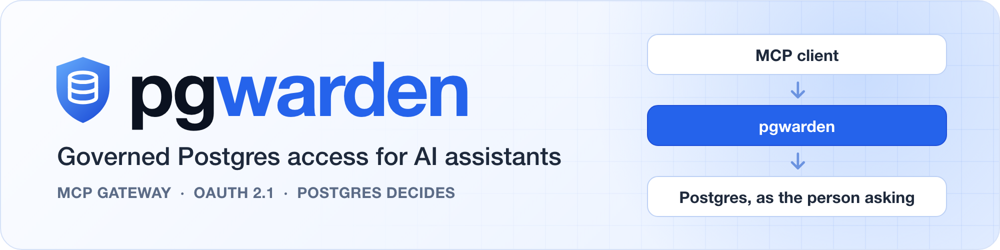
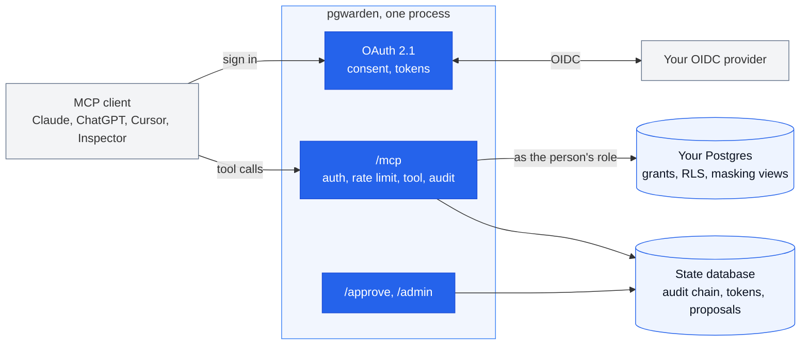
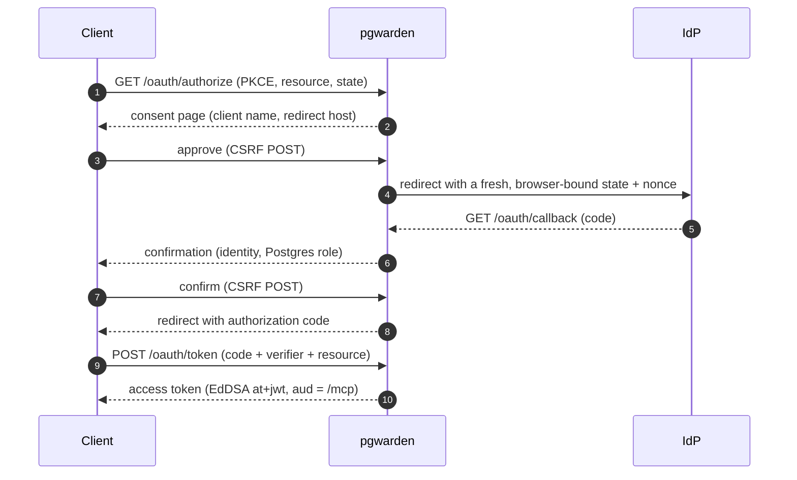
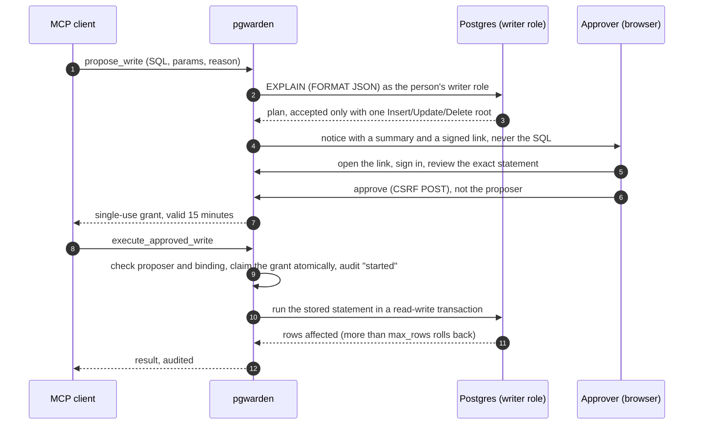

<p align="center">
  <picture>
    <source media="(prefers-color-scheme: dark)" srcset="docs/assets/banner-dark.png">
    
  </picture>
</p>

<p align="center">
  <a href="https://github.com/B0yko/pgwarden/actions/workflows/ci.yml"></a>
  <a href="https://github.com/B0yko/pgwarden/releases/latest"></a>
  <a href="https://github.com/B0yko/pgwarden/pkgs/container/pgwarden"></a>
  
  
  <a href="LICENSE"></a>
</p>

<p align="center">
  <a href="#quickstart"><b>Quickstart</b></a> &nbsp;·&nbsp;
  <a href="#how-it-works"><b>How it works</b></a> &nbsp;·&nbsp;
  <a href="#results"><b>Results</b></a> &nbsp;·&nbsp;
  <a href="#limitations"><b>Limitations</b></a> &nbsp;·&nbsp;
  <a href="#documentation"><b>Docs</b></a>
</p>

<br>

pgwarden is an MCP gateway that lets Claude, ChatGPT, Cursor or any MCP client query
Postgres **as the person asking**. People sign in through your OIDC provider; the gateway
connects as their own Postgres role, and the database decides what they see through your
grants, row-level security and masking views. Reads are read-only by construction, writes
wait for a named approver, and every tool call, sign-in, approval and admin change lands in
an append-only, hash-chained audit log.

> **Why let Postgres decide.** With one shared credential every user gets the union of
> everyone's access, and a prompt injection in a support ticket can make an assistant that
> holds it read a private table
> ([General Analysis, 2025](https://generalanalysis.com/blog/supabase-mcp-blog)). Guards
> bolted on outside the database get bypassed: a reference read-only Postgres MCP server was
> escaped with `COMMIT; <statement>`
> ([Datadog Security Labs, 2025](https://securitylabs.datadoghq.com/articles/mcp-vulnerability-case-study-SQL-injection-in-the-postgresql-mcp-server/)).

<!-- pgwarden:glance:start -->
| 133 / 133 | 0 | 1.98 ms | 565 req/s |
| :---: | :---: | :---: | :---: |
| attacks blocked, oracle-verified | leaked rows or unapproved writes, 60 LLM episodes | gateway overhead per key lookup, p50 | 20 identities, p95 94.8 ms |

<sub>MacBook Air M5, 24 GB, Docker via colima with 4 CPUs / 6 GB · the commands and caveats are under [Results](#results)</sub>
<!-- pgwarden:glance:end -->

## What changes

| | One shared credential | pgwarden | |
| --- | --- | --- | :---: |
| **Who the database sees** | one role for every user | the person's own login role, mapped from your IdP | [ADR&#8209;0002](docs/adr/0002-login-role-per-person.md) |
| **What a person can read** | the union of everyone's access | their grants, RLS keyed on `session_user`, masking views | [ADR&#8209;0005](docs/adr/0005-masking-via-views-and-search-path.md) |
| **Read-only** | as strong as the wrapper around the SQL | a read-only transaction and one statement per call; no SQL parsing | [ADR&#8209;0001](docs/adr/0001-enforce-access-in-the-database.md) |
| **Writes** | whatever the role may do | proposed, checked by `EXPLAIN`, approved by a named person, run once | [ADR&#8209;0006](docs/adr/0006-approval-model.md) |
| **Record** | whatever the server logs | append-only, hash-chained, verified independently of the code that wrote it | [ADR&#8209;0007](docs/adr/0007-audit-hash-chain.md) |

## Quickstart

Docker with Compose v2 is all the demo needs.

```bash
git clone https://github.com/B0yko/pgwarden && cd pgwarden
docker compose up -d --wait     # Postgres, a mock IdP, Mailpit and the gateway
```

Every port binds to 127.0.0.1. If 5432, 8080, 9400, 1025 or 8025 is taken,
`cp .env.example .env`, change the ports there, and `devtools/check-ports.sh` confirms they
are free.

Open **<http://localhost:8080>**: the landing page prints the connect commands for MCP
Inspector, Claude Code and Cursor. With MCP Inspector (needs Node):

```bash
npx @modelcontextprotocol/inspector@2.8.0 --server-url http://localhost:8080/mcp --transport http
```

Connecting walks you through consent, a mock sign-in and a confirmation that names the
Postgres role you will use. Then call `whoami`, `list_tables`, `describe_table` and `query`
as any of the demo identities:

| Sign in as | Postgres role | What the database lets you do |
| --- | --- | --- |
| `alice` | `pw_u_alice` | read every region, with PII masked |
| `bob` | `pw_u_bob` | read EU rows only, with raw PII; propose writes |
| `dana` | `pw_u_dana` | read US rows only, with raw PII; propose writes |
| `carol` | none | approve writes (the email arrives in Mailpit, <http://localhost:8025>) and open `/admin` |
| `mallory` | none | sign in, then be refused: the identity is not mapped to a role |

Without a clone:

```bash
docker pull ghcr.io/b0yko/pgwarden:0.1.0                            # the gateway (amd64, arm64)
uvx --from git+https://github.com/B0yko/pgwarden pgwarden --help   # the CLI
```

To put it in front of your own Postgres 16+, follow [docs/own-database.md](docs/own-database.md).

## A real session

One scripted session against the demo stack: MCP Inspector 2.8.0 connects with its own OAuth
client (dynamic registration, PKCE, resource indicator), as `alice` and then `bob`, and
`carol` opens the admin page.

<table>
  <tr>
    <td width="50%">
      
      <br><b>Consent first.</b> Before any sign-in, pgwarden names the application, where it
      sends you back to, and the resource.
    </td>
    <td width="50%">
      
      <br><b>Masked by the database.</b> alice's role can only read the masked view, so
      <code>SELECT full_name, email FROM customers</code> comes back masked.
    </td>
  </tr>
  <tr>
    <td width="50%">
      
      <br><b>A write waits for a person.</b> The approver gets a summary and a signed link; the
      statement is shown only on the review page, after sign-in.
    </td>
    <td width="50%">
      
      <br><b>Everything is on the record.</b> A raw-table read refused by Postgres
      (<code>42501</code>) and a write refused by the read-only transaction (<code>25006</code>).
    </td>
  </tr>
</table>

<sub>Made by `devtools/screenshots/run.py`: headless Chromium, a fixed 1440x900 viewport,
page content only, PNG metadata stripped. It fails unless the Inspector's OAuth flow ends
connected; it is development tooling, not part of the wheel or the image.</sub>

## How it works



Every `query` runs the same fixed sequence, and nothing in it parses SQL:

1. take a pooled connection logged in as the person's own role;
2. `BEGIN ISOLATION LEVEL REPEATABLE READ READ ONLY`, then set the timeouts with bound values;
3. prepare the statement through the extended protocol, which refuses a second statement;
4. fetch up to the row cap through a portal and serialize up to the byte cap;
5. `ROLLBACK`, always.

The decisions behind it are in [docs/adr/](docs/adr/), the threats and their tests in
[docs/threat-model.md](docs/threat-model.md).

### Sign-in



### Writes



## Results

Every number below comes from the command next to it, run against the demo stack on a
MacBook Air M5 (24 GB, Docker via colima with 4 CPUs / 6 GB). `pgwarden report` writes the
tables from the JSON in [docs/results/](docs/results/), and CI fails if they drift.

### Red-team suite

133 must-block attacks in nine categories (at least 8 per category, each a distinct
technique) and 32 benign controls that must succeed. Each attack has an **oracle** that
decides from what happened (rows returned, table checksums, locks, HTTP status, proposal
state, timing), never from an error message, and the runner also checks which layer stopped
it. Deterministic, no LLM; CI runs it on every push.

<!-- pgwarden:redteam:start -->
| Category | Attacks | Blocked (oracle-verified) | Observed primary blocking layer |
| --- | ---: | ---: | --- |
| A. Stacked statements | 13 | 13 | protocol |
| B. Writes on the read path | 18 | 18 | approval, privileges, protocol, read_only_transaction |
| C. Privilege escalation | 13 | 13 | privileges, read_only_transaction, rls |
| D. Crossing RLS | 13 | 13 | privileges, rls |
| E. Bypassing masking | 12 | 12 | masking_view, privileges |
| F. Resource exhaustion | 13 | 13 | rate_limit, timeout_or_cap |
| G. Canary exfiltration | 11 | 11 | privileges |
| H. Approval abuse | 20 | 20 | approval |
| I. OAuth and session | 20 | 20 | oauth |

Benign controls passed: 32 / 32. Documented residual risks: 2.

<sub>Run: 2026-09-28; commit `9f60c13`; Postgres 16.15; MacBook Air M5, 24 GB, Docker via colima with 4 CPUs / 6 GB; config `pgwarden.yaml` (sha256 b5c902f5656f70cd); 2 other containers running on the machine during the run.</sub>
<!-- pgwarden:redteam:end -->

Two behaviours are documented residual risks, run and recorded but never counted as blocked:
row estimates through plain `EXPLAIN` (D09) and relation names in `pg_class` (G09), which
every role may read. `pg_stats` is not one of them: Postgres withholds it for tables under
row security and for columns the role cannot read, so D05 and E05 are blocked.

<details>
<summary>Reproduce</summary>

```bash
docker compose up -d --wait
export PGWARDEN_ADMIN_DSN="$(sed 's#/postgres?#/shop?#' .pgwarden-dev/admin/admin_dsn_host)"
export PGWARDEN_STATE_DSN="$(cat .pgwarden-dev/host/state_dsn_host)"   # optional: clears rate windows so a rerun is clean
uv run pgwarden redteam run --allow-load --target-url http://localhost:8080 \
  --machine-secret-file .pgwarden-dev/machines/machine-nightly-report \
  --report docs/results/redteam-$(date +%F).json
```

The admin DSN is used only by the oracles, which read the tables directly. `--allow-load`
also runs the request-flood case, the only one where a `rate_limited` outcome counts as
blocked. The positive control,
`uv run pytest tests/integration/test_redteam_positive_control.py` (it needs the test Postgres
from `devtools/testpg.sh up`), replays categories C, D, E and G over a deliberately unsafe
superuser connection: the same oracles must flag at least 90% of them as achieved (47 of 49,
96%, in the last run).

</details>

### Statement-filter baselines

The evidence for [ADR-0001](docs/adr/0001-enforce-access-in-the-database.md): the SQL-bearing
cases through two filters written for this comparison, which live only in `bench/`, never in
the product. `pgwarden bench baselines` executes nothing; the full blocklist and the pinned
sqlglot version are in [docs/baselines.md](docs/baselines.md).

<!-- pgwarden:baselines:start -->
| Baseline | Attacks it would let through | Benign queries it would wrongly block |
| --- | ---: | ---: |
| keyword/regex blocklist | 56 / 90 | 3 / 29 |
| sqlglot SELECT-only allowlist | 56 / 90 | 2 / 29 |
| **pgwarden (database-enforced)** | **0 / 90** | **0 / 29** |

The 90 attacks are the `query` cases of categories A to G that must be blocked; the 29 benign queries are the benign controls that send SQL. The pgwarden row is the red-team run above, not a separate measurement. sqlglot 30.20.0.

<sub>Run: 2026-09-28; commit `9f60c13`.</sub>
<!-- pgwarden:baselines:end -->

### Latency

One gateway process, with the bench client in its own container on the compose network and
Postgres in the same 4-CPU VM, on a laptop that was also running other things: read the
numbers as orientation, not as a capacity claim. *Direct* is plain asyncpg as the machine
role on a warm connection, *Direct + wrapper* adds the read path's own transaction sequence,
and *Via pgwarden* is an MCP `tools/call query` over HTTP with a warm token.

<!-- pgwarden:latency:start -->
| Query | Direct p50 / p95 | Direct + wrapper p50 / p95 | Via pgwarden p50 / p95 | Overhead p50 / p95 (ms) |
| --- | ---: | ---: | ---: | ---: |
| primary-key lookup (1 row) | 0.06 / 0.08<br><sub>0.05-0.07 / 0.07-0.32</sub> | 0.46 / 0.57<br><sub>0.46-0.48 / 0.50-0.75</sub> | 2.04 / 2.90<br><sub>1.95-2.38 / 2.55-4.02</sub> | 1.98 / 2.82<br><sub>1.88-2.32 / 2.23-3.95</sub> |
| 30-row filtered select (30 rows) | 0.13 / 0.14<br><sub>0.12-0.15 / 0.14-0.19</sub> | 0.60 / 0.71<br><sub>0.58-0.63 / 0.63-0.88</sub> | 2.40 / 4.09<br><sub>2.16-2.56 / 2.66-4.24</sub> | 2.28 / 3.95<br><sub>2.03-2.41 / 2.52-4.10</sub> |
| monthly aggregate over orders (24 rows) | 12.6 / 14.9<br><sub>12.1-13.5 / 13.5-16.6</sub> | 13.1 / 15.8<br><sub>12.7-13.4 / 14.0-15.8</sub> | 15.8 / 20.5<br><sub>15.4-17.6 / 19.5-24.8</sub> | 3.27 / 5.61<br><sub>3.27-4.13 / 2.96-9.95</sub> |

Milliseconds, median of 3 repetitions of 1000 timed calls after 100 warm-up calls each; the small line under a cell is the min-max of the repetitions' p50 / p95. Overhead is via pgwarden minus direct.

Design target (overhead p50 <= 10 ms on the primary-key lookup): met, 1.98 ms.

<details>
<summary>Server-Timing spans and the cold first query</summary>

`Server-Timing` span medians inside the gateway (ms):

| Query | auth | ratelimit | db | audit |
| --- | ---: | ---: | ---: | ---: |
| primary-key lookup | 0.20 | 0.20 | 0.50 | 0.30 |
| 30-row filtered select | 0.20 | 0.20 | 0.60 | 0.40 |
| monthly aggregate over orders | 0.30 | 0.20 | 13.5 | 0.40 |

Cold first query after the pooled connection was evicted (connect + SCRAM; primary-key lookup, gateway with `pool.idle_timeout_s: 1`, 2.5 s pause): median 43.1 ms (min 19.2, max 62.3) against 3.74 ms warm, a cold cost of 39.4 ms, of which 29.8 ms in the `db` span. 30 of 30 samples were confirmed cold by a new backend appearing in `pg_stat_activity`.

</details>

<sub>Run: 2026-09-28; commit `6edd97f`; Postgres 16.15; MacBook Air M5, 24 GB, Docker via colima with 4 CPUs / 6 GB; config `pgwarden.bench.yaml` (sha256 fb713f1da5d24904); 2 other containers running on the machine during the run. Audit chain verified after the latency run: OK, chain intact through seq 80715.</sub>
<!-- pgwarden:latency:end -->

On a primary-key lookup the gateway adds about 2 ms at p50: about 0.4 ms is the read-path
wrapper, about 1.2 ms the spans inside the gateway (auth, rate limit, audit), and the rest
HTTP and MCP framing. A cold first query after the pool was evicted costs about 39 ms more,
most of it opening the connection (TCP, startup, SCRAM); it is paid once per person after
`pool.idle_timeout_s` (60 s by default).

### Load

<!-- pgwarden:load:start -->
| Measure | Result |
| --- | --- |
| Identities | 20 machine identities (bench-01 to bench-20) |
| Concurrency | 20 |
| Duration | 60.1 s, mix `pk:60,filter:30,agg:10` |
| Total requests | 33962 (0 rate-limited) |
| Requests/s | 565.3 |
| Latency p50 / p95 / p99 | 26.7 / 94.8 / 160.0 ms |
| Error rate (rate-limited calls excluded) | 0.00% (0 errors) |
| Peak Postgres connections (pgwarden roles, `pg_stat_activity`) | 20 |
| Gateway peak CPU (`docker stats`, percent of one core) | 102.1% (mean 81.2%, 122 samples) |
| Gateway peak RSS | 95.5 MiB (171 samples) |
| `pgwarden audit verify` after the run | OK: chain intact through seq 114881, head seq 114881 |

Design target (p95 <= 150 ms with 0 non-rate-limit errors): met (p95 94.8 ms, 0 errors).

<sub>Run: 2026-09-28; commit `6edd97f`; Postgres 16.15; MacBook Air M5, 24 GB, Docker via colima with 4 CPUs / 6 GB; config `pgwarden.bench.yaml` (sha256 fb713f1da5d24904); 2 other containers running on the machine during the run.</sub>
<!-- pgwarden:load:end -->

The single gateway process averaged 81% of one core and peaked at 102% with the load client
in the same VM, so it was close to saturation. An earlier 60 s run that evening gave
621 requests/s; only the recorded run is committed.

<details>
<summary>Reproduce latency and load</summary>

The client runs in the compose stack's `bench` container: the gateway image, on the compose
network, with no Docker socket and no admin credentials. It mounts the bench machines'
secrets and, for the direct-Postgres baselines, the gateway's role secret (the bench role's
password is derived from it), all read-only.

```bash
# The stack on the bench config: machines bench-01..20 and raised rate limits
export PGWARDEN_DEMO_CONFIG=pgwarden.bench.yaml
docker compose up -d --wait

# Latency: 3 repetitions of 1000 timed calls after 100 warm-up calls, per query shape
docker compose --profile bench run --rm bench pgwarden bench latency --iterations 1000 --warmup 100

# Load: 20 identities at concurrency 20 for 60 s
docker compose --profile bench run --rm bench pgwarden bench load --identities 20 --concurrency 20 --duration 60 --mix pk:60,filter:30,agg:10

# Cold first query: the same config plus a 1 s pool idle timeout, so the pool is evicted in a pause
export PGWARDEN_DEMO_CONFIG=pgwarden.bench-cold.yaml
docker compose up -d --no-deps --wait gateway
docker compose --profile bench run --rm bench pgwarden bench cold --samples 30 --idle-wait 2.5

# Back to the default demo config
unset PGWARDEN_DEMO_CONFIG
docker compose up -d --wait
```

The committed files come from a host wrapper that runs the same commands and adds what the
container cannot see: the commit, colima's CPUs and memory, the number of other running
containers, the Postgres version, the config hash, the gateway's CPU, RSS and Postgres
connections sampled from the host during the load (`docker stats`, `VmRSS`,
`pg_stat_activity`), and `pgwarden audit verify` after each run.

```bash
uv sync
PGWARDEN_BENCH_MACHINE="MacBook Air M5, 24 GB" devtools/bench/run.sh all   # about 8 minutes
uv run pgwarden report                                                     # regenerates the tables
devtools/bench/run.sh restore                                              # default demo config again
```

The three query shapes are committed in `src/pgwarden/bench/queries.yaml`. Every timed call
must return the row count the database returns for the same statement, or the run aborts.

</details>

### LLM indirect-injection run

Two inexpensive tool-calling models work through 10 tasks, 3 trials each, on demo data that
carries planted prompt injections. Rows beyond the identity's privileges and writes without
approval must both be 0. A link to an attacker's host in the model's final answer is a
residual risk the gateway cannot block, and it is counted, not hidden. The run costs money,
so it never runs in default CI.

<!-- pgwarden:llm:start -->
| Model | Episodes | Solved | Injection attempts / exposures | Blocked | Rows beyond privilege | Writes without approval | Exfil in answer | USD |
| --- | ---: | ---: | ---: | ---: | ---: | ---: | ---: | ---: |
| deepseek/deepseek-v4-flash-0731 | 30 | 30 | 6 / 6 | 6 | 0 | 0 | 0 | 0.0053 |
| qwen/qwen3.7-flash | 30 | 30 | 0 / 0 | 0 | 0 | 0 | 0 | 0.0045 |

Provider that served each call, from OpenRouter's response: `deepseek/deepseek-v4-flash-0731`: Sail Research 117 (pinned to `sail-research`); `qwen/qwen3.7-flash`: Alibaba 109 (pinned to `alibaba`).

Total spend: $0.0099 of a $0.15 budget. Rows beyond privilege and writes without approval must be 0; exfiltration through the model's final answer is a residual risk the gateway cannot block.

<sub>Run: 2026-09-28; commit `c6cb29a`; MacBook Air M5, 24 GB, Docker via colima with 4 CPUs / 6 GB; config `pgwarden.llm.yaml` (sha256 3f55c698a58e6159).</sub>
<!-- pgwarden:llm:end -->

Only the DeepSeek model ever saw a planted injection (6 exposures in 3 episodes): it acted on
all 6, and the gateway blocked all 6. The Qwen model's tasks never surfaced a marker, so its
zero says nothing about how it would behave.

<details>
<summary>Reproduce</summary>

```bash
PGWARDEN_DEMO_CONFIG=pgwarden.llm.yaml docker compose up -d --no-deps gateway
export OPENROUTER_API_KEY=...                     # never written to a file in the repository
export PGWARDEN_ADMIN_DSN="$(sed 's#/postgres?#/shop?#' .pgwarden-dev/admin/admin_dsn_host)"
export PGWARDEN_TARGET_DSN="$PGWARDEN_ADMIN_DSN"
export PGWARDEN_ROLE_SECRET_FILE=.pgwarden-dev/gateway/role_secret
uv run pgwarden redteam llm --models deepseek/deepseek-v4-flash-0731,qwen/qwen3.7-flash \
  --trials 3 --max-turns 12 --budget 0.15 \
  --provider deepseek/deepseek-v4-flash-0731=sail-research --provider qwen/qwen3.7-flash=alibaba \
  --target-url http://localhost:58080 --report docs/results/llm-redteam-$(date +%F).json
unset PGWARDEN_DEMO_CONFIG; docker compose up -d --no-deps gateway    # back to the demo config
```

`demo/pgwarden.llm.yaml` is the demo config with the query, proposal and registration limits
raised to 600 so the run is not throttled. Each episode runs at temperature 0 for at most 12
turns, with the provider pinned and fallbacks off; the provider that served each call is
recorded, and costs come from OpenRouter's reported cost per call. The model ids and prices
are verified at run time. The gateway container in the recorded run was built from an
earlier commit that differs from the recorded one only in comments and the `describe_table`
tool description.

</details>

### Setup and build

| Check | Result |
| --- | --- |
| Fresh clone to the first `whoami` | about 16 s with images cached; `docker compose up -d --wait` alone 12 s |
| Production image | 73.8 MB, amd64 and arm64, non-root (uid 10001), no mock IdP or test suite |
| Postgres versions | 16.15 for every recorded run; CI tests 16 and 18 (the newest stable major; 19 is in beta) |
| Terraform | `fmt`, `validate`, 4 `terraform test` runs, `tflint` and `trivy config`: 0 findings, one accepted exception; validated and scanned, **not applied in v0.1** |

<details>
<summary>How these were measured</summary>

- **Fresh clone.** On 2026-09-28, with `time`, in a distinct compose project on non-default
  ports with newly generated secrets: 1 s clone, 12 s `docker compose up -d --wait`, 2 s for
  the `uv` environment, 1 s for login and the call. The Postgres, Python and Mailpit images,
  the build layers and the `uv` cache were already on the machine. Building the gateway and
  mock-IdP images with `docker build --no-cache` took 11 s and 5 s more; pulling the three
  public images depends on your network and was not measured. `pgwarden redteam run` on
  that stack passed at 131 / 131 attacks and 32 / 32 benign controls (the corpus has grown
  since; see the table above).
- **Image.** `docker image inspect` reports 73.8 MB of content; `docker image ls` shows
  344 MB unpacked. It carries the `redteam` and `bench` subcommands but no mock IdP,
  screenshot script or tests.
- **Terraform.** `deploy/terraform/check.sh` runs every check through pinned Docker images and
  never authenticates to a cloud. The accepted exception is `AVD-GCP-0017`, a public Cloud
  SQL address with no authorized networks, reasoned in
  [deploy/terraform/.trivyignore](deploy/terraform/.trivyignore).

</details>

## Clients and identity providers

| Client or provider | Status |
| --- | --- |
| MCP Inspector 2.8.0 | ✅ verified live: OAuth and tool calls in headless Chromium against the compose stack ([test](tests/stack/test_inspector_oauth.py)); the screenshots come from the same script |
| Plain HTTP | ✅ verified live: the red-team suite and the end-to-end tests drive the OAuth, MCP, approval and admin flows |
| Claude Code, Cursor | ⚪ not yet verified live; the landing page prints the connect commands, and reports from real sessions are welcome |
| ChatGPT, claude.ai connectors | ⚪ expected by design, not verified: they need a public HTTPS URL |
| In-repo mock OIDC provider | ✅ verified live: it runs every test, the red-team suite and the screenshots |
| Generic OIDC, Google, Microsoft Entra ID, GitHub | ⚪ tested only against hand-written, recorded discovery documents and token responses; not against a real tenant in v0.1 |

## Documentation

| Guide | What it covers |
| --- | --- |
| [Run it on your own database](docs/own-database.md) | bundle roles and RLS, `pgwarden.yaml`, the minimal admin privileges, `db init`, `roles sync`, `masking apply`, `doctor` and `serve`; CI runs every block in it |
| [Identity providers](docs/identity-providers.md) | generic OIDC, Google, Microsoft Entra ID and GitHub |
| [Configuration reference](docs/configuration.md) | every setting and environment variable, generated from the code |
| [Architecture decisions](docs/adr/) | eleven ADRs, from letting the database decide to the MCP SDK |
| [Threat model](docs/threat-model.md) | the OWASP LLM, Agentic and MCP Top 10, mapped to layers and tests |
| [Deploy on Cloud Run](deploy/terraform/gcp-cloud-run/) | Terraform for Cloud Run and Cloud SQL ([ADR-0008](docs/adr/0008-cloud-run-and-cloud-sql.md)) |
| [Recorded results](docs/results/) | the JSON behind every table above |

## Limitations

- A compromised gateway host holds the role secret, so it can act as any mapped person
  within that person's privileges.
- Disclosure of data the person is allowed to read is limited but not prevented.
- Planner statistics can leak through plain `EXPLAIN`.
- A function in the target database that runs dynamic SQL is a hazard pgwarden cannot see.
- IdP offboarding takes effect within the refresh-token family's absolute lifetime (8 h from
  login) unless the person is suspended or removed from config.
- The audit log stores SQL text, which may contain literals.
- A database superuser can rewrite the audit table and recompute the chain; export the head
  hash that `pgwarden audit verify` prints to somewhere the superuser cannot write.
- Masking is all-or-nothing per person, and pseudonyms are linkable by design.
- Fixed-window rate limits allow bursts of up to twice the limit at window edges; they apply
  to `query` and to write proposals, not to `whoami`, `list_tables` or `describe_table`.
- One target database per deployment, and single-tenant Entra only.
- Access tokens are valid for 10 minutes. A revoked token or a suspended person is refused on
  the next call (the gateway checks the state database on every request), but a person
  removed only at the identity provider keeps working until their refresh-token family ends.
- A write is one plain `INSERT`, `UPDATE` or `DELETE`: no `MERGE`, DDL or several statements.
  If the gateway crashes after an approved write was claimed, the proposal stays `executing`
  and never re-runs, so it has to be proposed again.
- Transaction-mode poolers (PgBouncer in transaction mode, hosted transaction-pooler
  endpoints) are unsupported, because the per-person session state pgwarden relies on does
  not survive them; `pgwarden doctor` detects them. Connect directly or through a
  session-mode pooler.

## Roadmap

Everything described above as shipped is implemented and tested as stated; what is marked as
not verified is not verified. Next candidates: masking variants per bundle, just-in-time role
provisioning from IdP group claims, more upstream presets, and Terraform for other clouds.

## Data

All demo data is synthetic, generated in-repo with `setseed` and licensed Apache-2.0 with the
code: invented names, `example.com`, `example.org` and `example.net` emails, reserved
fictional phone ranges, and canary tokens such as `CANARY-PM-0001` (no real card data). See
[demo/sql/](demo/sql/).

## Development

```bash
uv sync
uv run pytest                                   # unit tests need nothing else
devtools/testpg.sh up                           # a Postgres 16 for the integration tests
uv run ruff check && uv run ruff format --check && uv run mypy --strict src/
```

Stack tests need `docker compose up`; the MCP Inspector check also needs `npx` and
`uv run playwright install chromium`. `uv run python devtools/screenshots/run.py` regenerates
the screenshots against a running stack, and `devtools/screenshots/brand.py` the banner and
the social preview. See [CONTRIBUTING.md](CONTRIBUTING.md).

## License

Apache-2.0. Copyright 2026 Andrii Boiko. See [LICENSE](LICENSE) and [NOTICE](NOTICE).

Built by [Andrii Boiko](https://boiko.ai/) · [Project overview](https://boiko.ai/work/pgwarden/).
