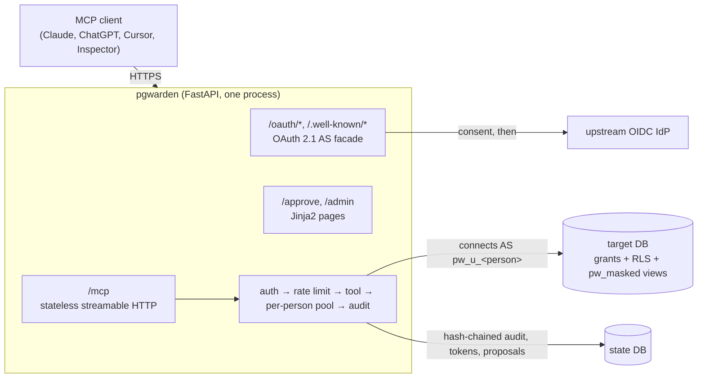
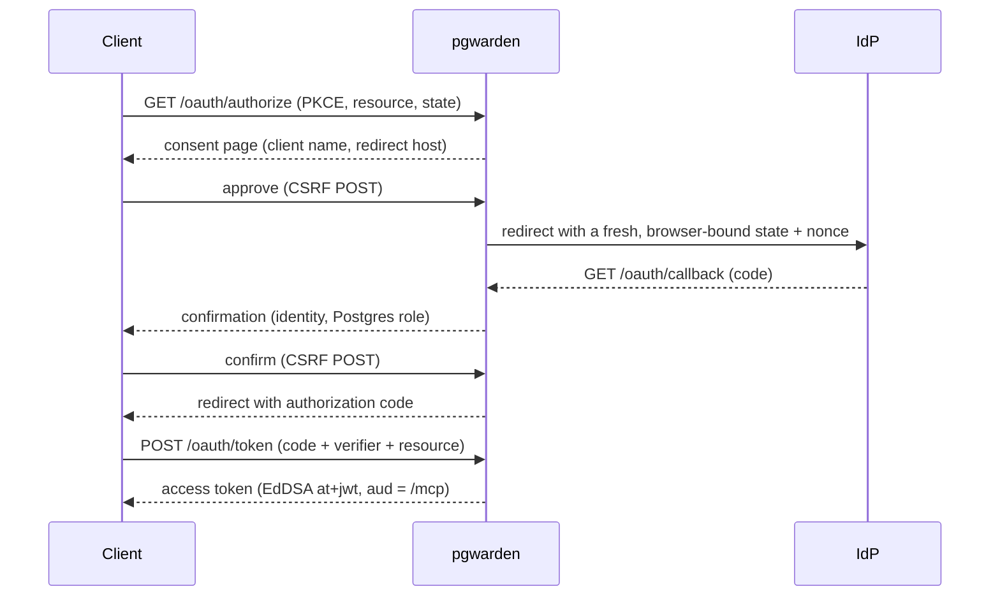
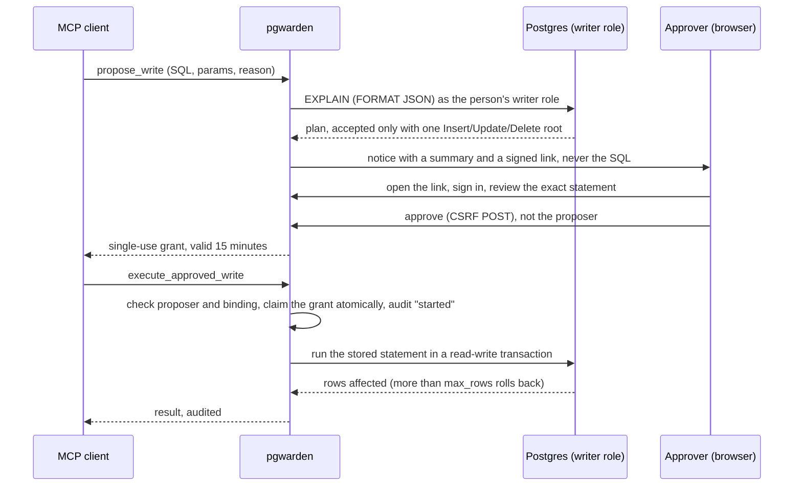

# pgwarden

**Governed Postgres access for AI assistants.** pgwarden is a drop-in MCP gateway
that lets Claude, ChatGPT, Cursor or any MCP client query your Postgres database
*as the person asking* — no shared password. Identity comes from your OIDC
provider through OAuth 2.1; **the database enforces access** through each person's
own login role, the DBA's grants, row-level security and masking views. Reads are
read-only by construction, writes wait for a named human approver, and every call
lands in an append-only, hash-chained audit log.

> One shared database credential gives every user the union of everyone's access,
> and a prompt injection in a support ticket can make an assistant holding that
> credential read a secrets table (General Analysis on Supabase MCP, 2025).
> Guarantees bolted on outside the database get bypassed: a reference read-only
> Postgres MCP server was escaped with `COMMIT; <statement>` (Datadog Security
> Labs, 2025). pgwarden's answer is to let Postgres decide, per person.

- **No SQL parsing.** pgwarden never inspects, rewrites or allowlists your SQL
  ([ADR-0001](docs/adr/0001-enforce-access-in-the-database.md)). It connects as the
  person's Postgres role and lets grants, RLS and a read-only transaction decide.
- **One login role per person**, with credentials derived from a secret and sent
  only as SCRAM verifiers ([ADR-0002](docs/adr/0002-login-role-per-person.md)).
  RLS keyed on `session_user` cannot be spoofed from SQL.
- **PII masking** by generated `security_barrier` views, enforced by the database,
  not by post-processing ([ADR-0005](docs/adr/0005-masking-via-views-and-search-path.md)).
- **Writes only through a human-approved queue**, validated by `EXPLAIN`, bound to
  the reviewed statement, executed at most once
  ([ADR-0006](docs/adr/0006-approval-model.md)).
- **Tamper-evident audit log**, verified independently of the SQL that wrote it
  ([ADR-0007](docs/adr/0007-audit-hash-chain.md)).
- **Backed by measurements**: a red-team suite with per-category, oracle-verified
  results; a comparison against statement-filter baselines; latency overhead and a
  load test — all reproduced by the commands below.

## Quickstart (under 5 minutes)

You need Docker (Compose v2) and the [`uv`](https://docs.astral.sh/uv/) CLI.

```bash
git clone https://github.com/B0yko/pgwarden && cd pgwarden
cp .env.example .env            # optional: change host ports (all bind to 127.0.0.1)
devtools/check-ports.sh         # fail early if a port is taken
docker compose up -d --wait     # Postgres, a mock IdP, Mailpit, and the gateway
```

Open <http://localhost:8080> for the landing page and the exact commands to connect
MCP Inspector, Claude Code and Cursor. For example:

```bash
npx @modelcontextprotocol/inspector@2.8.0 --server-url http://localhost:8080/mcp --transport http
```

Connect, and the browser walks you through consent, a mock sign-in (pick `bob`),
and a confirmation showing the Postgres role you will use. Then call `whoami`,
`list_tables`, `describe_table` and `query`. Sign in as `alice` to see PII masked;
as `bob` to see raw data but only EU rows; propose a write and approve it in
Mailpit at <http://localhost:8025>. The admin UI is at `/admin`.

The CLI runs without a clone, too:

```bash
uvx --from git+https://github.com/B0yko/pgwarden pgwarden --help
```

## How it works



Every `query` call runs the same fixed sequence, with no SQL parsing anywhere:
acquire the person's connection, `BEGIN ISOLATION LEVEL REPEATABLE READ READ ONLY`,
set the timeouts with bound values, prepare the statement through the extended
protocol (which rejects a second statement), fetch up to the row cap through a
portal, serialize up to the byte cap, and always `ROLLBACK`. See
[docs/adr](docs/adr/) for the decisions and [docs/threat-model.md](docs/threat-model.md)
for the threat model.

### The OAuth flow



### A real session

The four screenshots below come from one scripted session against the demo stack:
MCP Inspector 2.8.0 connects through its own OAuth client (dynamic client
registration, PKCE, resource indicator), first as `alice`, then as `bob`, and the
admin page is opened as `carol`.

<table>
  <tr>
    <td width="50%">
      
      <br><b>1. Consent.</b> Before any sign-in, pgwarden names the application, where it
      sends you back to, and the resource. Only continue if you started the connection.
    </td>
    <td width="50%">
      
      <br><b>2. A masked query as alice.</b>
      <code>SELECT full_name, email FROM customers ORDER BY id LIMIT 5</code>: alice's role
      can only read the masked view, so names and emails come back masked.
    </td>
  </tr>
  <tr>
    <td width="50%">
      
      <br><b>3. An approval request in Mailpit.</b> bob proposed a write. The approver gets a
      summary and a signed link; the statement and its parameters are shown only on the
      review page after sign-in.
    </td>
    <td width="50%">
      
      <br><b>4. The audit log.</b> The admin page (carol) for alice's session: the masked query
      succeeded, a read of the raw table was refused by Postgres (<code>42501</code>) and a
      write was refused by the read-only transaction (<code>25006</code>).
    </td>
  </tr>
</table>

`devtools/screenshots/run.py` produces them (headless Chromium, fixed 1440x900
viewport, page content only, PNG metadata stripped) and fails if the Inspector's
OAuth flow does not end connected with the tool list visible. It is development
tooling and is not part of the wheel or the production image.

### The approval flow



## Results

All numbers below come from the commands shown, on a MacBook Air M5, 24 GB, Docker
via colima with 4 CPUs / 6 GB, against the demo stack. Regenerate the tables with
`pgwarden report`.

### Red-team suite

131 must-block attacks in nine categories (at least 8 per category, each a distinct
technique) and 32 benign controls, run by `pgwarden redteam run` (deterministic, no LLM;
runs in CI on every push). Each attack has an **oracle** that decides from database
state, not from the error text, whether the objective was achieved, and the runner
also checks that the layer that stopped it is the one the case expected. The run needs
the admin DSN only for the oracles, which read the tables directly:

```bash
docker compose up -d --wait
export PGWARDEN_ADMIN_DSN="$(sed 's#/postgres?#/shop?#' .pgwarden-dev/admin/admin_dsn_host)"
export PGWARDEN_STATE_DSN="$(cat .pgwarden-dev/host/state_dsn_host)"   # optional: clears rate windows so a rerun is clean
uv run pgwarden redteam run --allow-load --target-url http://localhost:8080 \
  --machine-secret-file .pgwarden-dev/machines/machine-nightly-report \
  --report docs/results/redteam-$(date +%F).json
```

`--allow-load` also runs the request-flood case, the only one where a `rate_limited`
outcome counts as blocked. `uv run pytest tests/integration/test_redteam_positive_control.py`
is the positive control: the same oracles flag 45 of 47 cases in categories C, D, E and G
(96%) when the corpus is replayed over a deliberately unsafe superuser connection.

<!-- pgwarden:redteam:start -->
| Category | Attacks | Blocked (oracle-verified) | Observed primary blocking layer |
| --- | ---: | ---: | --- |
| A. Stacked statements | 13 | 13 | protocol |
| B. Writes on the read path | 18 | 18 | approval, privileges, protocol, read_only_transaction |
| C. Privilege escalation | 13 | 13 | privileges, read_only_transaction, rls |
| D. Crossing RLS | 12 | 12 | privileges, rls |
| E. Bypassing masking | 11 | 11 | masking_view, privileges |
| F. Resource exhaustion | 13 | 13 | rate_limit, timeout_or_cap |
| G. Canary exfiltration | 11 | 11 | privileges |
| H. Approval abuse | 20 | 20 | approval |
| I. OAuth and session | 20 | 20 | oauth |

Benign controls passed: 32 / 32. Documented residual risks: 4.
<!-- pgwarden:redteam:end -->

The four documented residual risks are recorded, asserted to behave as documented, and
never counted as blocked: planner statistics through `pg_stats` on a table with row-level
security (D05) and on a masked column (E05), row estimates through plain `EXPLAIN` (D09),
and relation names in `pg_class`, which every role may read (G09).

### Statement-filter baselines

`pgwarden bench baselines` runs the same corpus through two filters that live only
in `bench/`, never in the product — the evidence for
[ADR-0001](docs/adr/0001-enforce-access-in-the-database.md). The full blocklist and
the pinned sqlglot version (30.20.0) are published in [docs/baselines.md](docs/baselines.md);
both filters were written for this comparison.

<!-- pgwarden:baselines:start -->
| Baseline | Attacks it would let through | Benign queries it would wrongly block |
| --- | ---: | ---: |
| keyword/regex blocklist | 54 / 88 | 3 / 29 |
| sqlglot SELECT-only allowlist | 54 / 88 | 2 / 29 |
| **pgwarden (database-enforced)** | **0 / 88** | **0 / 29** |
<!-- pgwarden:baselines:end -->

### Latency and load

Measured on 2026-09-28 on a MacBook Air M5, 24 GB, Docker via colima with 4 CPUs / 6 GB.
The laptop was shared, not idle: the bench client, the gateway and Postgres all ran in
the same 4-CPU colima VM, two other containers (the test suite's Postgres and PgBouncer)
were running, and so were other programs. Absolute numbers therefore move from run to
run (two full 60 s load runs that evening gave 621 and 565 requests/s); read them as an
orientation for one gateway process on a laptop, not as a capacity claim. Nothing here
was run on a server.

The client runs in its own `bench` container of the compose stack: the same image as the
gateway, on the compose network (so every request crosses a network hop), with no Docker
socket and no admin credentials. It mounts the bench machines' secrets and, for the
direct-Postgres baselines, the gateway's role secret (the login password of the bench
role is derived from it), all read-only.

```bash
# The stack on the bench config: machines bench-01..20 and raised rate limits
export PGWARDEN_DEMO_CONFIG=pgwarden.bench.yaml
docker compose up -d --wait

# Latency: 3 repetitions of 1000 timed calls after 100 warm-up calls, per query shape
docker compose --profile bench run --rm bench pgwarden bench latency --iterations 1000 --warmup 100

# Load: 20 identities at concurrency 20 for 60 s
docker compose --profile bench run --rm bench pgwarden bench load --identities 20 --concurrency 20 --duration 60 --mix pk:60,filter:30,agg:10

# Cold first query: the same config plus a 1 s pool idle timeout, so the pool is evicted in a pause
export PGWARDEN_DEMO_CONFIG=pgwarden.bench-cold.yaml
docker compose up -d --no-deps --wait gateway
docker compose --profile bench run --rm bench pgwarden bench cold --samples 30 --idle-wait 2.5

# Back to the default demo config
unset PGWARDEN_DEMO_CONFIG
docker compose up -d --wait
```

Those commands print the numbers. The committed files in [docs/results/](docs/results/)
come from a host wrapper that runs the same commands and adds what the container cannot
see: the commit, colima's CPUs and memory, the number of other running containers, the
Postgres version and the config hash, the gateway's CPU, RSS and Postgres connections
sampled from the host during the load (`docker stats`, `VmRSS` and `pg_stat_activity`,
several samples a second), and the result of `pgwarden audit verify` after each run:

```bash
uv sync
PGWARDEN_BENCH_MACHINE="MacBook Air M5, 24 GB" devtools/bench/run.sh all   # about 8 minutes
uv run pgwarden report                                                     # regenerates the tables below
devtools/bench/run.sh restore                                              # default demo config again
```

`devtools/bench/run.sh latency|cold|load` runs one part (`cold` adds to the latency file).
The three query shapes are committed in `src/pgwarden/bench/queries.yaml`. In the latency
table, *Direct* is plain asyncpg from the bench container as the machine role
`pw_m_bench_01` on a warm connection, *Direct + wrapper* is the read path's own
`BEGIN READ ONLY` / `set_config` / prepare / fetch / `ROLLBACK` sequence on a pooled
connection, and *Via pgwarden* is an MCP `tools/call query` over HTTP with a warm token.
Overhead is the last minus the first. Every timed call must return the row count the
database returns for the same statement, or the run aborts.

<!-- pgwarden:latency:start -->
| Query | Direct p50 / p95 | Direct + wrapper p50 / p95 | Via pgwarden p50 / p95 | Overhead p50 / p95 (ms) |
| --- | ---: | ---: | ---: | ---: |
| primary-key lookup (1 row) | 0.06 / 0.08<br><sub>0.05-0.07 / 0.07-0.32</sub> | 0.46 / 0.57<br><sub>0.46-0.48 / 0.50-0.75</sub> | 2.04 / 2.90<br><sub>1.95-2.38 / 2.55-4.02</sub> | 1.98 / 2.82<br><sub>1.88-2.32 / 2.23-3.95</sub> |
| 30-row filtered select (30 rows) | 0.13 / 0.14<br><sub>0.12-0.15 / 0.14-0.19</sub> | 0.60 / 0.71<br><sub>0.58-0.63 / 0.63-0.88</sub> | 2.40 / 4.09<br><sub>2.16-2.56 / 2.66-4.24</sub> | 2.28 / 3.95<br><sub>2.03-2.41 / 2.52-4.10</sub> |
| monthly aggregate over orders (24 rows) | 12.6 / 14.9<br><sub>12.1-13.5 / 13.5-16.6</sub> | 13.1 / 15.8<br><sub>12.7-13.4 / 14.0-15.8</sub> | 15.8 / 20.5<br><sub>15.4-17.6 / 19.5-24.8</sub> | 3.27 / 5.61<br><sub>3.27-4.13 / 2.96-9.95</sub> |

Milliseconds, median of 3 repetitions of 1000 timed calls after 100 warm-up calls each; the small line under a cell is the min-max of the repetitions' p50 / p95. Overhead is via pgwarden minus direct.

`Server-Timing` span medians inside the gateway (ms):

| Query | auth | ratelimit | db | audit |
| --- | ---: | ---: | ---: | ---: |
| primary-key lookup | 0.20 | 0.20 | 0.50 | 0.30 |
| 30-row filtered select | 0.20 | 0.20 | 0.60 | 0.40 |
| monthly aggregate over orders | 0.30 | 0.20 | 13.5 | 0.40 |

Cold first query after the pooled connection was evicted (connect + SCRAM; primary-key lookup, gateway with `pool.idle_timeout_s: 1`, 2.5 s pause): median 43.1 ms (min 19.2, max 62.3) against 3.74 ms warm, a cold cost of 39.4 ms, of which 29.8 ms in the `db` span. 30 of 30 samples were confirmed cold by a new backend appearing in `pg_stat_activity`.

Design target (overhead p50 <= 10 ms on the primary-key lookup): met, 1.98 ms.

Run: 2026-09-28; commit `6edd97f`; Postgres 16.15; MacBook Air M5, 24 GB, Docker via colima with 4 CPUs / 6 GB; config `pgwarden.bench.yaml` (sha256 fb713f1da5d24904); 2 other containers running on the machine during the run.
Audit chain verified after the latency run: OK, chain intact through seq 80715.
<!-- pgwarden:latency:end -->

Reading the latency table: on a primary-key lookup the gateway adds about 2 ms at p50 and
under 3 ms at p95. The read-path wrapper accounts for about 0.4 ms of that (0.46 against
0.06 ms), and the `Server-Timing` spans add up to about 1.2 ms of the 2 ms (auth, rate limit
and audit are each a few tenths of a millisecond); the rest is HTTP and MCP framing and the
client itself. On the monthly aggregate the query dominates (13.5 ms in `db`) and the gateway
adds about 3 ms. The cold first query is dominated by opening the database connection
(TCP, startup, SCRAM): about 30 ms of the extra 39 ms sit in the `db` span, and the other
few milliseconds are `auth` and `ratelimit` also being slower after a 2.5 s pause, so the
`db` figure is the better estimate of connect + SCRAM. It is paid once per person or machine
after a pooled connection was idle for `pool.idle_timeout_s` (60 s by default). The cold run
uses machine `bench-01`; a person's pool goes through the same connection code.

<!-- pgwarden:load:start -->
| Measure | Result |
| --- | --- |
| Identities | 20 machine identities (bench-01 to bench-20) |
| Concurrency | 20 |
| Duration | 60.1 s, mix `pk:60,filter:30,agg:10` |
| Total requests | 33962 (0 rate-limited) |
| Requests/s | 565.3 |
| Latency p50 / p95 / p99 | 26.7 / 94.8 / 160.0 ms |
| Error rate (rate-limited calls excluded) | 0.00% (0 errors) |
| Peak Postgres connections (pgwarden roles, `pg_stat_activity`) | 20 |
| Gateway peak CPU (`docker stats`, percent of one core) | 102.1% (mean 81.2%, 122 samples) |
| Gateway peak RSS | 95.5 MiB (171 samples) |
| `pgwarden audit verify` after the run | OK: chain intact through seq 114881, head seq 114881 |

Design target (p95 <= 150 ms with 0 non-rate-limit errors): met (p95 94.8 ms, 0 errors).

Run: 2026-09-28; commit `6edd97f`; Postgres 16.15; MacBook Air M5, 24 GB, Docker via colima with 4 CPUs / 6 GB; config `pgwarden.bench.yaml` (sha256 fb713f1da5d24904); 2 other containers running on the machine during the run.
<!-- pgwarden:load:end -->

Reading the load table: the design targets were met on this run. The gateway is a single
process; it averaged 81% of one core and peaked at 102% while the load client shared the
VM, which suggests one gateway process was close to saturated. Postgres held one
connection per active identity (peak 20). The design targets are goals, not claims: the
numbers above are whatever the run measured.

### LLM indirect-injection run

`pgwarden redteam llm` drives two inexpensive tool-calling models through the demo
stack, whose data carries planted prompt injections. Rows returned beyond the
identity's privileges and writes executed without approval must both be zero;
exfiltration through the model's final answer is a residual risk the gateway cannot
block, reported honestly. This run costs money and is never in default CI.
The stack runs `demo/pgwarden.llm.yaml` for it, the demo config with the query,
proposal and registration limits raised to 600 so the run is not throttled.

<!-- pgwarden:llm:start -->
| Model | Episodes | Tasks solved | Marker exposures | Injection-induced attempts | Attempts per exposure | Attempts blocked | Rows beyond privilege | Writes without approval | Exfil-in-answer episodes | Spend (USD) |
| --- | ---: | ---: | ---: | ---: | ---: | ---: | ---: | ---: | ---: | ---: |
| `deepseek/deepseek-v4-flash-0731` | 30 | 30 | 6 | 6 | 1.00 | 6 | 0 | 0 | 0 | 0.0069 |
| `qwen/qwen3.7-flash` | 30 | 30 | 0 | 0 | n/a | 0 | 0 | 0 | 0 | 0.0052 |

Total spend: $0.0121 of a $5.00 budget. Rows beyond privilege and writes without approval must be 0; exfiltration through the model's final answer is a residual risk the gateway cannot block.
<!-- pgwarden:llm:end -->

The models used and their prices are verified at run time; the recorded run's full
JSON is in [docs/results/](docs/results/).

### Setup, versions and infrastructure checks

- **Setup.** On a fresh clone (a distinct compose project, non-default ports, new secrets
  generated), `docker compose up -d --wait` took 12 s and the whole red-team suite passed
  there (131 / 131 attacks blocked, 32 / 32 benign controls). From `git clone` to the first
  `whoami` through the OAuth flow took about 16 s: 1 s clone, 12 s compose, 2 s for the
  `uv` environment, 1 s for login and the call. That was with the Postgres, Python and
  Mailpit images, the build layers and the `uv` cache already on the machine; a cold pull
  and build depends on your network and was not measured.
- **Image.** The production image runs as a non-root user (uid 10001), contains no mock
  IdP or test tooling, and is 73.8 MB of compressed content (344 MB unpacked on disk).
- **Versions.** The full test suite and every recorded run above used Postgres 16.15 and
  Python 3.12. CI runs the database tests on Postgres 16 and 18 (18 is the newest stable
  major on 2026-09-28; 19 is still in beta).
- **Terraform.** `deploy/terraform/check.sh` runs `terraform fmt -check`, `terraform
  validate` (module and example), `terraform test` (4 runs with mock providers), `tflint`
  and `trivy config` through pinned Docker images and never authenticates to a cloud:
  everything passes with 0 findings, after one accepted exception (`AVD-GCP-0017`, a
  public Cloud SQL address with no authorized networks, reasoned in
  [deploy/terraform/.trivyignore](deploy/terraform/.trivyignore)). The module is validated
  and scanned, **not applied in v0.1**.

## Verified clients and identity providers

| MCP client | Status |
| --- | --- |
| MCP Inspector 2.8.0 | Verified live: the OAuth flow and tool calls run in headless Chromium against the compose stack (`tests/stack/test_inspector_oauth.py`; the screenshots above come from the same script) |
| Plain HTTP client | Verified live: the red-team suite and the end-to-end tests drive every endpoint |
| Claude Code, Cursor | **Not yet verified live.** The landing page prints the connect commands; issue reports from real sessions are welcome |
| ChatGPT, claude.ai connectors | Expected by design, not verified: they need a public HTTPS URL |

| Identity provider | Status |
| --- | --- |
| In-repo mock OIDC provider | Verified live: it runs every test, the red-team suite and the screenshots |
| Generic OIDC, Google, Microsoft Entra ID, GitHub | Tested only against hand-written, recorded discovery documents and token responses; not verified against a real tenant in v0.1 |

## Use it on your own database

pgwarden works on the bundled demo data and on your own Postgres 16+ through
configuration. See [docs/own-database.md](docs/own-database.md) for creating bundle
roles and RLS (keyed on `session_user`), writing `pgwarden.yaml`, the minimal admin
privileges, and running `db init`, `roles sync`, `masking apply`, `doctor` and
`serve`. [docs/identity-providers.md](docs/identity-providers.md) covers generic
OIDC, Google, Entra and GitHub. [docs/configuration.md](docs/configuration.md) is
the full configuration reference, generated from the code.

Deploy to Google Cloud Run + Cloud SQL with the Terraform module in
[deploy/terraform/gcp-cloud-run/](deploy/terraform/gcp-cloud-run/)
([ADR-0008](docs/adr/0008-cloud-run-and-cloud-sql.md)).

## Limitations

- A compromised gateway host holds the role secret, so it can act as any mapped
  person within that person's privileges.
- Disclosure of data the person is allowed to read is limited but not prevented.
- Planner statistics can leak through plain `EXPLAIN`.
- A function in the target database that runs dynamic SQL is a hazard pgwarden
  cannot see.
- IdP offboarding takes effect within the refresh-token family's absolute lifetime
  (8 h from login) unless the person is suspended or removed from config.
- The audit log stores SQL text, which may contain literals.
- A database superuser can rewrite the audit table and recompute the chain; export
  the head hash that `pgwarden audit verify` prints to somewhere the superuser
  cannot write.
- Masking is all-or-nothing per person, and pseudonyms are linkable by design.
- Fixed-window rate limits allow bursts of up to twice the limit at window edges.
- One target database per deployment, and single-tenant Entra only.

## Roadmap

Everything in v0.1 is real and tested. Candidate next steps: masking variants per
bundle, just-in-time role provisioning from IdP group claims, more upstream
presets, and Terraform for other clouds.

## Data

All demo data is synthetic, generated in-repo with `setseed`, and licensed
Apache-2.0 with the code: invented names, `example.com`/`example.org`/`example.net`
emails, reserved fictional phone ranges, and canary tokens that look like
`CANARY-PM-0001` (no real card data). See [demo/sql/](demo/sql/).

## Development

`uv sync`, then `uv run pytest` (unit tests need nothing; integration tests need a
Postgres 16 via `devtools/testpg.sh up`; stack tests need `docker compose up`, and the
MCP Inspector OAuth check also needs `npx` and `uv run playwright install chromium`).
To regenerate the README screenshots against a running stack:
`uv run python devtools/screenshots/run.py`.
`uv run ruff check`, `uv run ruff format --check` and `uv run mypy --strict src/`
must pass. See [CONTRIBUTING.md](CONTRIBUTING.md).

## License

Apache-2.0. Copyright 2026 Andrii Boiko. See [LICENSE](LICENSE) and [NOTICE](NOTICE).
