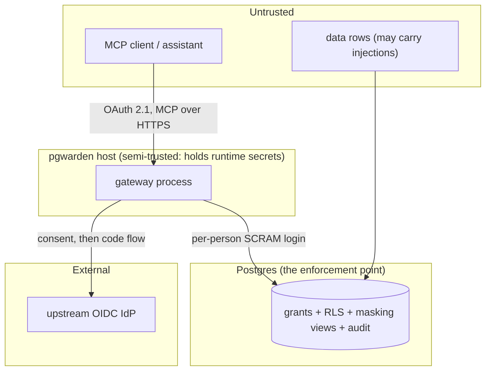

# Threat model

This is pgwarden's threat model: what it protects, who it defends against, where the
trust boundaries are, and which layer stops each threat. The OWASP taxonomies cited
here are pinned in [threat-model-ids.yaml](threat-model-ids.yaml) and checked by CI
(`tests/unit/test_threat_model.py`): every ID of all three lists appears in at least
one row, the IDs match the pinned names, and every cited test ID exists.

Taxonomy versions: OWASP Top 10 for LLM Applications 2025 (LLM01–LLM10); OWASP Top
10 for Agentic Applications 2026 (ASI01–ASI10); OWASP MCP Top 10 2025, beta/pilot
(MCP01–MCP10).

## Assets

- The data in the target database, especially PII and the canary `billing.*` tokens.
- The integrity of writes (no unapproved or over-scoped mutation).
- The audit log's completeness and tamper-evidence.
- The gateway's secrets: the role secret, the token signing key, the session secret,
  and the upstream client secret.
- Each person's identity and their bounded, per-role access.

## Actors

- **The author of malicious data rows** — plants prompt injections in ticket bodies
  and product descriptions that a compromised assistant may act on.
- **A confused or compromised assistant** — issues attacker-directed tool calls.
- **A malicious MCP client** — forges or replays tokens, tampers with the OAuth flow.
- **An insider with a valid identity** — tries to exceed their own role.
- **A network attacker** — intercepts or rebinds connections.
- **A compromised gateway host** — holds the runtime secrets.

## Trust boundaries

The boundary that matters most is between the gateway and Postgres: the gateway is
only an identity and policy conduit, and even a fully compromised gateway is bounded
by what each person's Postgres role may do (except that it holds the role secret, a
documented residual risk).

## Threats and mitigations

Each mitigated row cites test IDs: red-team corpus cases (`redteam:<id>`, in
`src/pgwarden/redteam/attacks/`) and/or pytest tests (`<file>::<test>`).

| Threat | LLM | Agentic | MCP | Mitigating layer | Test IDs | Residual risk |
| --- | --- | --- | --- | --- | --- | --- |
| Prompt injection in data rows directs the assistant to read, escalate or write | LLM01 | ASI01 | MCP06 | The database bounds what any tool call can do, per person | redteam:C01, redteam:G01, redteam:D01 | Exfiltration through the model's final answer (see below) |
| PII reaches the model's context | LLM02 | ASI03 | MCP10 | Masking views + search_path; RLS | redteam:E01, redteam:E03, test_masking.py::test_alice_reads_masked_columns_through_the_view | Data the person may read is not hidden |
| Improper output handling — row data treated as instructions | LLM05 | ASI06 | MCP03 | Rows returned in a field labelled untrusted; tools tell the model to use $n params | test_mcp_gateway.py::test_query_as_alice_is_masked | The model may still act on row content |
| Excessive agency — an unapproved or over-scoped write | LLM06 | ASI02 | MCP02 | Approval queue: EXPLAIN validation, single-use grant, at-most-once execution | redteam:B01, test_approvals.py::test_propose_approve_execute, test_approvals.py::test_max_rows_exceeded_rolls_back | — |
| System-prompt / tool-description leakage steering the assistant | LLM07 | ASI09 | MCP03 | Tool descriptions carry no secrets; consent shows the client and redirect host | test_oauth_e2e.py::test_full_flow_as_bob | — |
| Stacked statements / command injection (`COMMIT; ...`) | LLM06 | ASI02 | MCP05 | Extended-protocol Parse rejects a second statement (42601) | redteam:A01, redteam:A02, test_readpath.py | — |
| Privilege escalation via SET ROLE / set_config / GRANT | LLM06 | ASI03 | MCP02 | Per-person login role; read-only transaction; privileges | redteam:C01, redteam:C03, redteam:C06, test_shared_login_experiment.py | — |
| Crossing row-level security to read another region | LLM02 | ASI03 | MCP02 | RLS keyed on session_user, TO PUBLIC | redteam:D01, redteam:D02, test_roles_sync.py::test_bob_set_role_writer_allowed_bundle_refused | Planner statistics can leak counts (documented) |
| Canary/secret-table exfiltration | LLM02 | ASI02 | MCP02 | Grants: no bundle can read billing.* | redteam:G01, redteam:G06 | — |
| Resource exhaustion / unbounded consumption | LLM10 | ASI08 | MCP05 | statement_timeout, row and byte caps, connection limits | redteam:F01, redteam:F03, redteam:F04 | Memory for one oversized row is bounded by the byte cap |
| Token mismanagement / forged or passed-through tokens | LLM06 | ASI03 | MCP01 | Own EdDSA tokens, audience-bound; upstream tokens rejected | test_oauth_server.py::test_mcp_rejects_upstream_style_and_unsigned_tokens, test_jwt.py::test_wrong_audience_rejected | Compromised host holds the signing key |
| Insufficient authentication / authorization at /mcp | LLM06 | ASI03 | MCP07 | Bearer required, 401 with WWW-Authenticate; unmapped → 403 | test_mcp_gateway.py::test_missing_token_is_401_with_www_authenticate, test_mcp_gateway.py::test_unmapped_identity_is_403 | IdP offboarding lags by ≤8 h unless suspended |
| Confused deputy — a proxy that consents before naming the client | LLM06 | ASI09 | MCP07 | Per-client consent before the upstream redirect; __Host- cookies | test_oauth_e2e.py::test_consent_csrf_and_browser_binding | — |
| Lack of audit / telemetry | LLM09 | ASI10 | MCP08 | Append-only hash-chained audit; independent verify | test_audit.py::test_chain_verifies_after_records, test_audit.py::test_superuser_row_edit_is_detected | A superuser can rewrite it and recompute (export head hash) |
| DNS rebinding / session hijacking | LLM05 | ASI07 | MCP07 | Origin/Host allowlist; stateless (no session to hijack) | test_mcp_gateway.py::test_server_timing_header_present | — |
| Approval abuse (self-approval, replay, tamper) | LLM06 | ASI02 | MCP02 | Approver ≠ proposer; signed single-use links; binding hash | test_approvals.py::test_self_approval_is_refused, test_approvals.py::test_tampered_sql_is_refused_at_execution | — |
| Supply-chain compromise of the gateway's own build/deps | LLM03 | ASI04 | MCP04 | Pinned deps (uv.lock, hashes), digest-pinned images, SHA-pinned actions, Trivy | test present in CI (security.yml) | Upstream compromise before pinning |
| Data/model poisoning of the underlying model | LLM04 | ASI06 | — | Out of scope: pgwarden does not train or host the model | (not applicable) | The model itself is out of scope |
| Vector/embedding weaknesses | LLM08 | — | — | Not applicable: pgwarden has no vector store | (not applicable) | — |
| Misinformation in the model's answer | LLM09 | — | — | Not applicable: pgwarden governs access, not answer quality | (not applicable) | The model may still be wrong |
| Unexpected code execution (RCE) on the host | — | ASI05 | MCP05 | No user code runs in the gateway; SQL runs only in Postgres as the person | redteam:C08, redteam:C09 | A compromised host is out of pgwarden's control |
| Insecure inter-agent communication | — | ASI07 | — | Not applicable: pgwarden is a single server, no agent-to-agent channel | (not applicable) | — |
| Cascading failures across agents | LLM10 | ASI08 | — | Per-role connection and rate limits bound blast radius | redteam:F09, test_ratelimit.py::test_cross_process_shared_counter | — |
| Rogue / shadow MCP servers impersonating this one | LLM06 | ASI10 | MCP09 | Fixed canonical resource URL; audience-bound tokens; documented deployment | test_oauth_server.py::test_http_metadata | A user could still connect a client to a rogue server |
| Human–agent trust exploitation at the consent screen | LLM07 | ASI09 | MCP07 | Consent names the client and the redirect host; deny is one click | test_oauth_e2e.py::test_deny_redirects_with_access_denied | A user can still approve a malicious client |

### The residual risk pgwarden cannot block

Exfiltration through the model's **final answer** — the model reads data the person
is allowed to see and includes it in a reply, possibly in a markdown image URL to an
attacker's host. pgwarden bounds *what the model can read* to the person's own
privileges, but cannot control what the person's own client does with a legitimate
answer. This is reported honestly by `pgwarden redteam llm` (episodes whose final
answer contains an `exfil.example.net` URL) and is not counted as blocked.
EOF
echo "threat-model.md written"